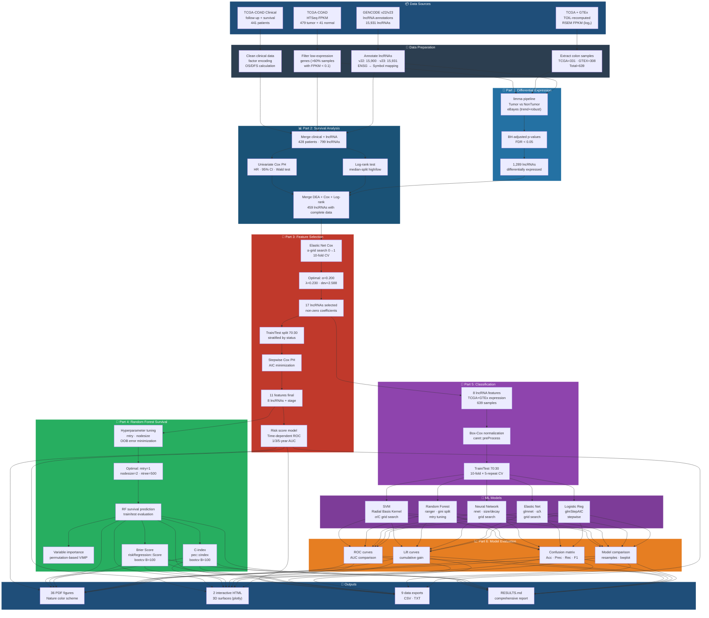

# CRC lncRNA Analysis Pipeline Flowchart



## Pipeline Summary

| # | Part | Input | Method | Output |
|---|------|-------|--------|--------|
| 1 | **DEA** | 60,498 genes × 639 samples | limma + eBayes | 1,289 DE lncRNAs |
| 2 | **Survival** | 428 patients × 799 lncRNAs | Cox PH + Log-rank | 459 lncRNAs with HR + p |
| 3 | **Feature Selection** | 459 lncRNAs | Elastic Net + Stepwise Cox | 11 features (8 lncRNAs + stage) |
| 4 | **RF Survival** | Train=300, Test=128 | randomForestSRC | OOB error, VIMP, Brier, C-index |
| 5 | **Classification** | 639 samples × 8 lncRNAs | SVM · RF · NNET · EN · LR | 5 trained models |
| 6 | **Evaluation** | 5 models | ROC · Lift · Confusion | Performance comparison |
| 7 | **Export** | All above | Nature-style visualization | 36 PDFs + 2 HTML + 9 data files |

## Key Results

```
                    Train     Test      AUC
SVM                 97.1%  →  92.1%    0.969  ★
Neural Network      96.9%  →  92.1%    0.973  ★
Random Forest      100.0%  →  91.1%    0.974
─────────────────────────────────────────────
Cox Risk Score      C=0.82  →  AUC~0.725 (8yr)
Elastic Net         α=0.20  →  17 lncRNAs selected
```
